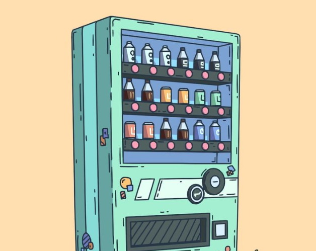

# Vending Machine Project

## Table of contents
- [Description](#Description)
- [Libraries](#Libraries)
- [Objectives](#Objectives)

## Describtion

This is a college project for programming course! 
The project is vending machine with a variuos products to buy from, the vending machine has two modes:   

-- Programming mode for the for the programmer to add products, remove products, or edit their price.  
-- Operating mode for the customers to buy the products they would like to.   

The vending machine project is implemented in C++ and utilizes object-oriented programming principles. It consists of several classes such as `VendingMachine` class, and `Product` class, each has its attributes, and methods.   

In the programming mode, the programmer can access a menu to add new products to the vending machine, remove existing products, or modify their prices. This mode provides flexibility for managing the inventory and adjusting prices based on market demands.   

On the other hand, the operating mode is designed for customers to interact with the vending machine. They can select the desired product by entering the corresponding code or using a touch screen interface. The machine will then dispense the chosen product and deduct the appropriate amount from the customer's balance.   

To enhance the user experience, the vending machine also includes features such as displaying the available products, providing change if necessary, and notifying the customer if a selected product is out of stock.   

## Libraries
#Vectors# : We used vectors library for storing the products in the vending machine.  

## Objectives
The project aims to simulate a real-world vending machine scenario and serves as a practical exercise for learning C++ programming concepts. It provides an opportunity to practice object-oriented design, encapsulation, and inheritance.  